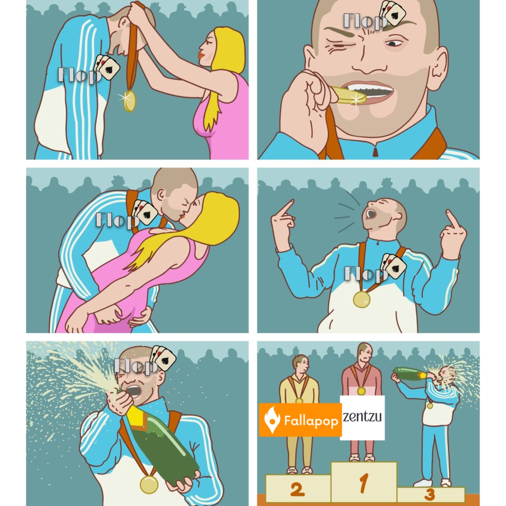

#  [The Flop](https://theflopapp.vercel.app/)
A mobile dating-style application with a casino theme, built using Ionic, Angular, and Firebase.

---

##  Description

**The Flop** is a mobile application where users can discover matches and interact through a real-time chat system.

The app is inspired by casino mechanics, featuring elements like cards, **ALL IN / PASS**, and a stylized UI that creates a playful and immersive experience.

---

##  Features

* 🔐 Authentication (Login & Register) with Firebase Auth
* 👤 User profile creation & editing
* 🎴 Match system (LIKE / DISLIKE)
* 💬 Real-time chat between matched users
* ✔ Message status:
  * ✔ Message sent status
  * ✔✔ Message seen status
* 🔔 Unread message indicator
* 🗑 Chat deletion
* 🎵 Optional background music in chat
* 📊 User statistics
* 📘 Integrated tutorial system
* 💾 Draft message persistence
* 🎭 Custom empty states
* 🎮 Interactive mascot screen

---

## Core Logic

* Match system based on **mutual likes**
* Message grouping by date *(Today / Yesterday / custom date)*
* Seen system using `seenBy` array
* Dynamic chat sorting by last message
* Unread message detection

---

##  Stack

* **Frontend:** Ionic + Angular
* **Backend:** Firebase
  * Authentication
  * Firestore
  * Storage
* **Language:** TypeScript
* **Styling:** SCSS

---

##  Project Structure

```
pages/
 ├── login
 ├── register
 ├── home (matches)
 ├── profile
 ├── chat-list
 ├── chat
 ├── stats
 └── slot
```

---

##  Installation

```bash
git clone https://github.com/FestikUwU/TheFlopTFG.git
cd the-flop
npm install
ionic serve
```

---

##  [Build APK](https://drive.google.com/file/d/1Q_Wu5pU2Hvbu1EMrgvB6rtp3ruo2ltWf/view?usp=sharing)

```bash
ionic build
npx cap sync android
npx cap open android
```

---

##  Notes

* Developed as a **Final Degree Project (TFG)**
* This project was developed for educational purposes as a Final Degree Project (TFG).
* Some features are still in development

---

##  Author

**Heorhii Tykhonov**

2026

---

##  License

© 2026 Heorhii — Final Degree Project
Unauthorized academic use is prohibited.
